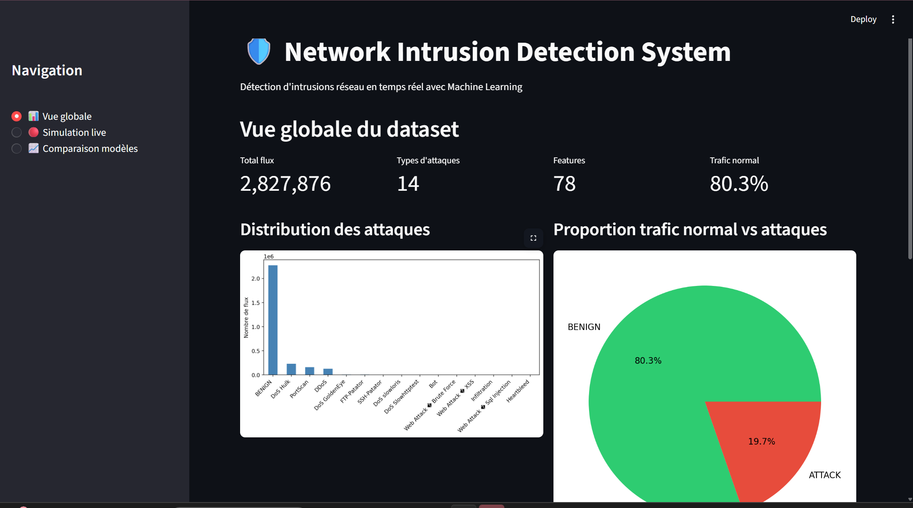
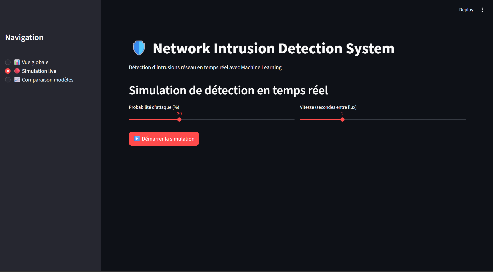
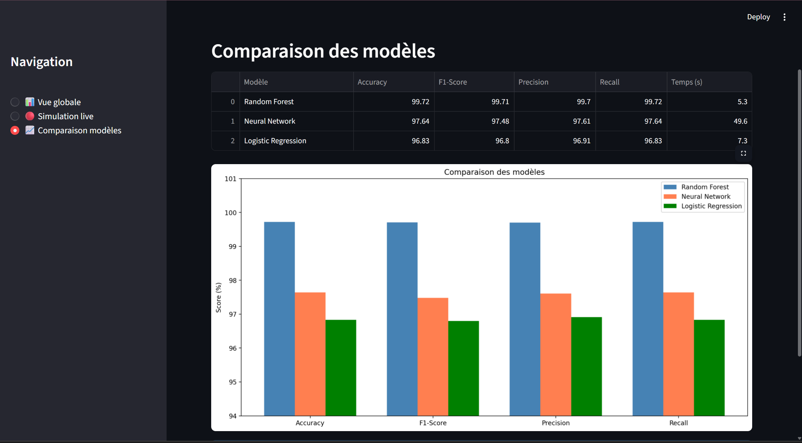

# 🛡️ Network Intrusion Detection System

A complete machine learning system that detects network intrusions and cyberattacks in real time, trained on 2.8 million network flows across 15 attack types.

## 📊 Dashboard





## 🎯 Results

| Model | Accuracy | F1-Score | Training Time |
|-------|----------|----------|---------------|
| XGBoost | 99.82% | 99.82% | 19s |
| Random Forest | 99.72% | 99.71% | 6s |
| Neural Network | 97.64% | 97.48% | 137s |
| Logistic Regression | 96.83% | 96.80% | 9s |

## 🔍 Attack Types Detected

| Attack | Count |
|--------|-------|
| DoS Hulk | 230,124 |
| PortScan | 158,804 |
| DDoS | 128,025 |
| DoS GoldenEye | 10,293 |
| FTP-Patator | 7,935 |
| SSH-Patator | 5,897 |
| DoS slowloris | 5,796 |
| DoS Slowhttptest | 5,499 |
| Bot | 1,956 |
| Web Attack - Brute Force | 1,507 |
| Web Attack - XSS | 652 |
| Infiltration | 36 |
| Web Attack - SQL Injection | 21 |
| Heartbleed | 11 |

## 🏗️ Project Structure

```
network-intrusion-detection/
├── analysis.py          # Level 1 - Binary DDoS detection
├── multiclass.py        # Level 2 - 15 attack types
├── compare_models.py    # Level 3 - Model comparison
├── dashboard.py         # Level 4 - Streamlit dashboard
├── imbalanced.py        # Level 5 - SMOTE class balancing
└── requirements.txt
```

## 🚀 How it works

1. Load and clean 2.8M network flows from CICIDS 2017
2. Train Random Forest classifier on 78 features
3. Evaluate with precision, recall, F1-score
4. Visualize detections in real-time dashboard
5. Handle class imbalance with SMOTE oversampling

## 💡 Key Findings

- **Random Forest** outperforms Neural Network and Logistic Regression on this task
- **SMOTE** significantly improves detection of rare attacks (Web Attack XSS: 0% → 100% recall)
- Class imbalance is a major challenge in real-world intrusion detection

## 🛠️ Tech Stack

- **Python** — core language
- **scikit-learn** — ML models (Random Forest, Neural Network, Logistic Regression)
- **imbalanced-learn** — SMOTE oversampling
- **Streamlit** — interactive dashboard
- **Pandas / NumPy** — data processing
- **Matplotlib / Seaborn** — visualization

## 📦 Installation

```bash
git clone https://github.com/Jabbarmaiga1/network-intrusion-detection
cd network-intrusion-detection
pip install -r requirements.txt
```

Download the CICIDS 2017 dataset from [here](https://www.unb.ca/cic/datasets/ids-2017.html) and place the CSV files in the project folder.

## ▶️ Usage

```bash
# Level 1 - Binary detection
python analysis.py

# Level 2 - Multiclass detection
python multiclass.py

# Level 3 - Compare models
python compare_models.py

# Level 4 - Launch dashboard
streamlit run dashboard.py

# Level 5 - SMOTE analysis
python imbalanced.py
```

## 📁 Dataset

CICIDS 2017 — Canadian Institute for Cybersecurity
- 2,827,876 network flows
- 78 features per flow
- 15 classes (BENIGN + 14 attack types)

## 👤 Author

**Abdoul Jabbar Maiga**
CS & ML Master's student @ ECUT, China
[LinkedIn](https://www.linkedin.com/in/abdoul-jabbar-maiga-b68225361/) | [Live Demo](https://network-intrusion-detection-k4navapemyf9yu9u4bxdxx.streamlit.app/)